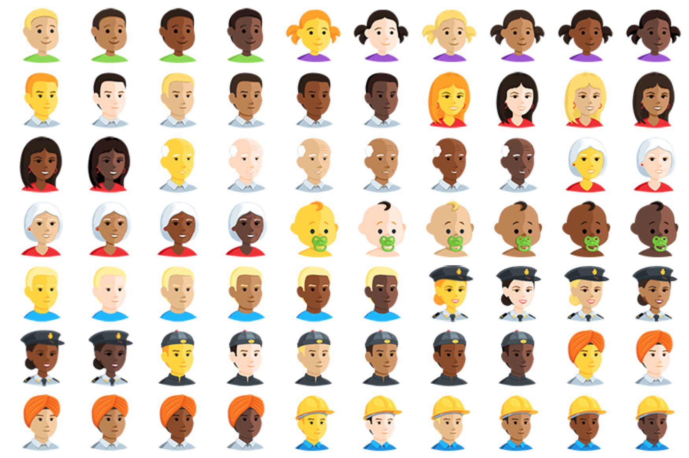

# Who Can Attend ScalaBridge workshops?

ScalaBridge reaches out to people who are **underrepresented** in tech. A person **does not** have to be a woman to be underrepresented. Diversity comes in many forms: race, gender, age, religion, culture, sexual orientation, socioeconomic background, etc.  

The goal of the workshop is not to exclude anyone, rather, it is to create a safe learning environment for people who are interested in learning Scala and to create an inclusive community.

All the attendees of ScalaBridge must follow [Scala Code of Conduct](https://www.scala-lang.org/conduct/). Micro-aggressive behavior or sexual harassment are not tolerated. All ScalaBridge organizers have the right to ask a person, who violated the code of conduct or made other attendees feel threatened, to leave the workshop at any time.

 

## :arrow_right: Next Step:
- Ready to organize a ScalaBridge workshop? Go [here](./README.md#bulb-how-to-organize-a-scalabridge-workshop).

- Go back to the [table of content](./README.md).
