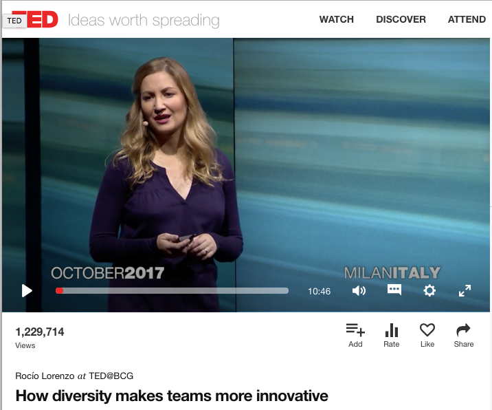
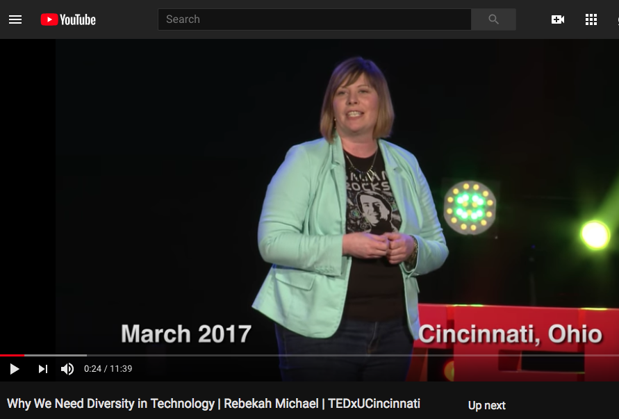
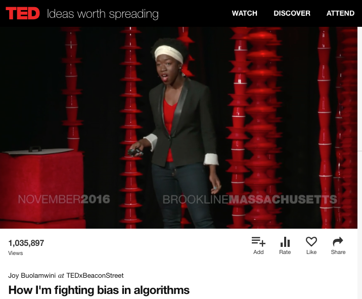

# :high_brightness: Why is Diversity Important?

> We want a balance of gender, age, ethnicity, and other qualities to make sure the teams are approaching problems holistically and creating solutions that are going to meet the needs of all kinds of people. 

 

## :cat: :dog: What is a diverse community?
A diverse community can be formed by people with different gender, religious, race, age, disability, linguistic differences, social-economic status and cultural backgrounds.

 :rabbit: :frog: :tiger: :koala: :bear: :pig: :cow: :boar: :monkey_face: :monkey: :horse: :racehorse: :camel: :sheep: :elephant: :panda_face: :snake: :bird: :hatched_chick: :penguin: :turtle: :bug: :honeybee: :ant: :whale: :fish: :octopus:

 

## :warning: What happens if we have a community that has no diversity?
> There are real-world cautionary tales of what happens when you don’t have gender diversity on your engineering teams.

Three Examples from **Nora Denzel Keynote Speech - Grace Hopper Celebration 2012**:

> 1. Early speech recognition machines were made by all-male teams, and they calibrated it for their voices. When they tried to sell to primarily female secretarial teams, the technology failed miserably.

> 2. The same thing happened with car air bags. The team developing the air-bag was all-male, and as they designed it, they used the height and weight chart for the standard man. The unintended and tragic consequence was that women and children were killed when those early airbags were deployed.

> 3. As you may know, over a billion people don’t have access to a reliable water source. Multi-disciplinary engineering teams went into 15 African countries, and later teams went in to study which teams were the most successful. When women were included on the engineering teams and in the customer research to identify the solution, the solution was more effective and lasted longer.

 
 

## :tv: TED Talks on Diversity

### How diversity makes teams more innovative - Rocío Lorenzo

 

### Why We Need Diversity in Technology - Rebekah Michael

 

### How I'm fighting bias in algorithms - Joy Buolamwini

 

**:wavy_dash: Above quotes are from this [blog](https://medium.com/women-in-tech/women-in-tech-the-missing-force-e4709f348610).**

## :arrow_right: Next Step:
- Ready to organize a ScalaBridge workshop? Go [here](./README.md#bulb-how-to-organize-a-scalabridge-workshop).

- Go back to the [table of content](./README.md).
